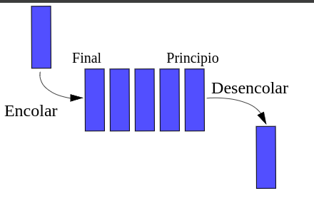

# 1. Create a structure called "Student" with members name, age, and total marks. Write a C program to input data for two students, display their information, and find the average of total marks.

# 2. Define a structure named Time with members hours, minutes, and seconds. Write a C program to input two times, add them, and display the result in proper time format.

# 3. Create a structure named Book to store book details like title, author, and price. Write a C program to input details for three books, find the most expensive and the lowest priced books, and display their information.

<!-- # 4. Define a structure named Circle to represent a circle with a radius. Write a C program to calculate the area and perimeter of two circles and display the results. -->

<!-- # 5. Create a structure named "Employee" to store employee details such as employee ID, name, and salary. Write a program to input data for three employees, find the highest salary employee, and display their information. -->

<!-- # 6. Define a structure named "Date" with members day, month, and year. Write a C program to input two dates and find the difference in days between them. -->

<!-- # 7. Write a C program that implements a simple queue using a structure. The structure should contain an array representing the queue and front and rear indices. Include functions for enqueue and dequeue operations.

 -->

# 8. Create a structure named Complex to represent a complex number with real and imaginary parts. Write a C program to add and multiply two complex numbers.