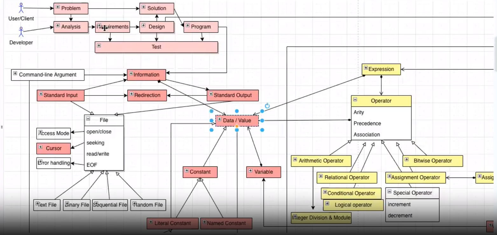

# Funciones (subrutinas) libres en C. Comentarios TODO 
-Crear código reutilizable
-Evitar la redundancia de código
-Subrutina es la palabra genérica para llamar a una función o procedimiento
-Apegarse a la convecnió de google (linter, cpplint)
- Hacer comentarios TODO en el código

## Biblioteca estándar de C. Leer un carácter con scanf()
- stdio.h es en encabezado en C
- <cstdio> es un encabezado en C++
- scanf va y localiza el valor que el programado necesita
https://cplusplus.com/reference/cstdio/scanf/
buscar la documentación de scanf en la pag de cpp (ver marcador de chrome)

int scanf (const char* format)

- printf();

            funcion para imprimir 
            char caracter devuelve un valor tipo entero
            por tanto para printf pueda imprimirlo se debe enviar la dirección
            de memoria de la variable mediante:
            &character

## Archivos. Entrada estándar. Cursores

## Concepto de archivo. Final de archivo (EOF, end-of-file)
Scanf se detiene cuando se encuentra con el EOF. EOF devuelve un valor númerico. 

## Valor de retorno de scanf(). Chequeo de errores en C
 (scanf("En algún d%c la mancha", &character) != EOF){
  Cambiar el EOF dependiendo de la cantidad de %c que  haya en el scanf 

## Inicializar todas las variables.
Es una buena práctica de progrmación inicializar las variables una vez declaradas.
Buscar el valor de inicilización de sus debidas tipos de variables 

## Leer varios valores con scanf(). Imprimir en el erro estándar
Tiene 3 archivos sabiertos por defecto, la entrada, la salida, error estandar -> fprintf
fprintf(stderr, %d, number)

importante dejar un espacio blanco en el scanf ejemplo (scanf("%c%d , &character" , &number) == 2)
